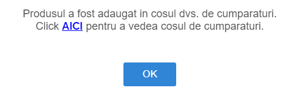

### Button versus link

Pentru că de multe ori se folosesc butoane în loc de link-uri sau invers, ne-am gândit la un exercițiu care să te ajute să înțelegi când îl folosim pe fiecare și de ce. 

Un caz ar putea fi atunci când realizăm un shop online.

