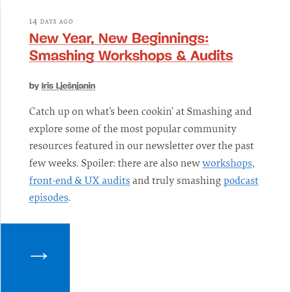

### Card component

Scrie structura HTML pentru următorul card. Acest element este și el des întâlnit în realizarea paginilor web, așa că te va ajuta foarte mult să afli cum să îl faci. Va trebui să ai în vedere și lucrurile învățate în lecțiile anterioare (de exemplu [lecția despre texte](https://FrontEnd.ro/html/texte).).
 
Nu trebuie să stilizezi nimic, încă nu am ajuns la partea de CSS. 

**Hint 1**: pentru date va trebui să folosești un element de care nu am discutat încă în lecții și anume [time-element](https://developer.mozilla.org/en-US/docs/Web/HTML/Element/time). 

**Hint 2**: link-ul care duce către autorul articolului, se va deschide într-un nou tab, iar calea e [link-autor](https://www.smashingmagazine.com/author/iris-ljesnjanin/).
