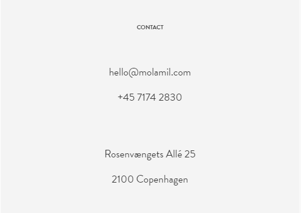

### Link-uri către email sau către numere de telefon

Sunt situații în care vrem să oferim unui user posibilitatea de a deschide email-ul pentru a trimite un mesaj nou sau să apeleze un număr de telefon. (cel mai frecvent de pe dispozitivele mobile).

Hai să exersăm aceste cazuri și să scriem structura HTML pentru exemplul de mai sus.
